# 🍉 freekey admin 自由钥匙 - 后台管理系统

## 说明

freekey admin(自由钥匙) 一个V2EX风格 `Golang+React+NextJS` 写的后台管理系统，提供了权限管理、本地文件上传等基本功能。
使用到的技术:

- 后台: GoFrame
- 前台: React, Nextjs, SWR, Axios, React-toastify, Js-cookie

> 如果对 React、Nextjs、SWR 不了解，请先学习这三个框架
> - [React](https://github.com/facebook/react) : React是由Facebook开发的用于构建用户界面的JavaScript库
> - [next.js](https://github.com/vercel/next.js) : Nextjs是一个基于React的服务器端渲染框架，用于构建可扩展的React应用程序
> - [swr](https://github.com/vercel/swr) : SWR是一种React Hooks库，用于在数据获取方面提供高度自动化和简化的体验。

## 🍒 内置功能

### 1. 系统

菜单, API, 角色, 管理员, 字典, 文件, 操作日志, 登录日志, 账变类型, 账变统计, 账变报表, banner

### 2. 用户业务

用户管理, 用户登录日志, 用户钱包, 充值类型, 账变记录, 账变统计, 账变报表, 充值订单
> GoFrame框架支持全自动化的接口文档生成，保障代码与接口文档同步维护，自动生成的接口文档采用的是标准的OpenAPIv3协议。
>
> 相关文档 https://goframe.org/pages/viewpage.action?pageId=47703679
>
> 项目运行后在 http://127.0.0.1:2033/swagger 查看

### 3. 商品业务 todo

### 4. 小说业务 todo

### 5. 论坛业务 todo

### 6. 聊天业务 todo

## 🌸 环境安装

### 后台

1. golang环境 安装
2. mysql 安装
3. redis 安装
4. gf 安装 https://goframe.org/pages/viewpage.action?pageId=1115782

### 前台

1. nodejs 安装
2. nextjs 安装

## 项目结构

```text

├── backend                     后台项目 
│   ├── api                     对外接口	对外提供服务的输入/输出数据结构定义。考虑到版本管理需要，往往以api/xxx/v1...存在.
│   ├── hack                    工具脚本	存放项目开发工具、脚本等内容。例如，CLI工具的配置，各种shell/bat脚本等文件。
│   ├── internal                内部逻辑  业务逻辑存放目录。通过Golang internal特性对外部隐藏可见性。
│   │   ├── cmd                 入口指令  命令行管理目录。可以管理维护多个命令行。
│   │   ├── consts              常量定义  项目所有常量定义。
│   │   ├── controller          接口处理  接收/解析用户输入参数的入口/接口层。
│   │   ├── dao                 数据访问  数据访问对象，这是一层抽象对象，用于和底层数据库交互，仅包含最基础的 CURD 方法
│   │   ├── logic               业务封装  业务逻辑封装管理，特定的业务逻辑实现和封装。往往是项目中最复杂的部分。
│   │   ├── model               结构模型  数据结构管理模块，管理数据实体对象，以及输入与输出数据结构定义。
│   │   ├── packed
│   │   ├── service             业务层   负责业务逻辑的处理， 具体执行 logic 层
│   │   └── z_httptest          接口测试 
│   ├── manifest                交付清单  包含程序编译、部署、运行、配置的文件。常见内容如下：
│   │   └── config              配置管理  配置文件存放目录。
│   ├── resource                静态资源
│   └── utility                 公共工具  不同项目可公用的工具方法放此目录
└── frontend                    前台项目
    ├── compoents               组件
    ├── consts                  常量
    ├── data                    数据工具
    ├── libs                    业务工具
    ├── pages                   页面
    │   └── backend             后台页面
    └── public                  静态资源
        ├── css
        ├── fonts
        └── image
```

## ✨️ 快速开始

### 后台运行

1. 下载项目 https://github.com/1211ciel/ciel-admin/archive/refs/tags/v2.0.zip
2. 创建数据库并导入项目 `/backend/freekey_admin.sql`
3. 修改 `/backend/manifest/config/config.yaml` 文件配置:mysql,redis 信息替换成您自己的
4. 进入 `/backend` 目录下 运行 `go mod tidy` 下载依赖。下载完成后 运行 `gf run main.go`

### 前台运行

1. 进入 `/frontend` 目录下 运行 `npm install` 下载项目依赖
2. 下载完成后 运行 `npm run dev`
3. 访问  http://localhost:3000 用户名: `admin` 密码: `1`

## 接口快速开发

这里以用户创建充值订单的前后台的所有功能进行示例讲解。 [点击查看](docs/demo_interface.md)

## 🌈 CSS

在项目中，使用了两套CSS样式：白天和黑夜。这些样式包括了许多不同的元素，例如按钮（.btn）、标签（.tag）、图标（.icon）、信息框（.info-box）、主题（.theme）、输入框（.input）和表格（.table）等等。可以在不同的网站上使用，以提高用户体验和设计美感。

通过使用这些样式，你可以快速地创建出一个现代化和美观的网站。

样式文件在 `/freekey-admin/frontend/public/css`

项目启动后可以在 http://localhost:3000/backend/sys/test?name=CSS 页面进行查看

以下是一些常用样式:


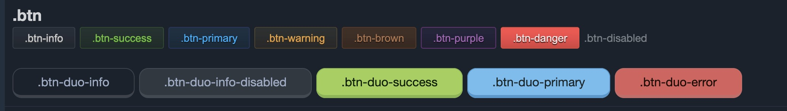

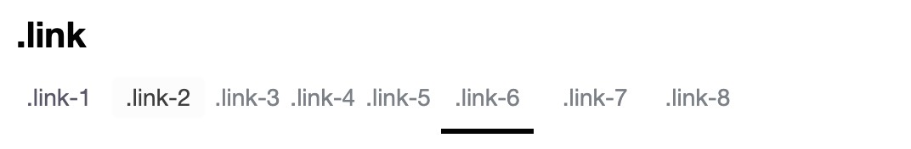
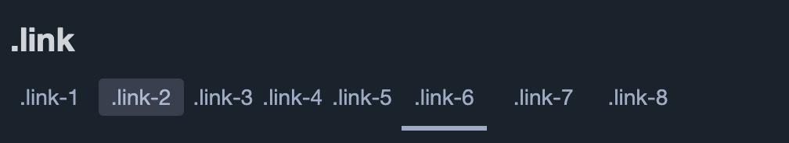

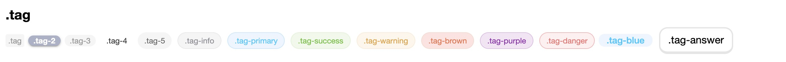
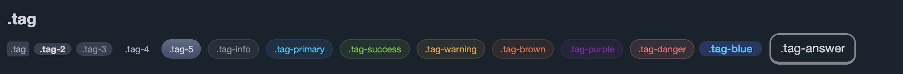

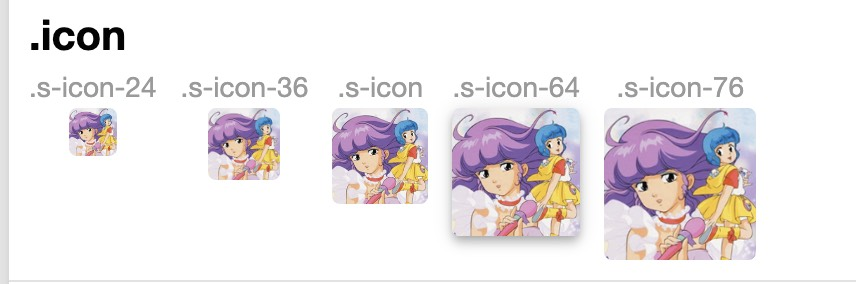
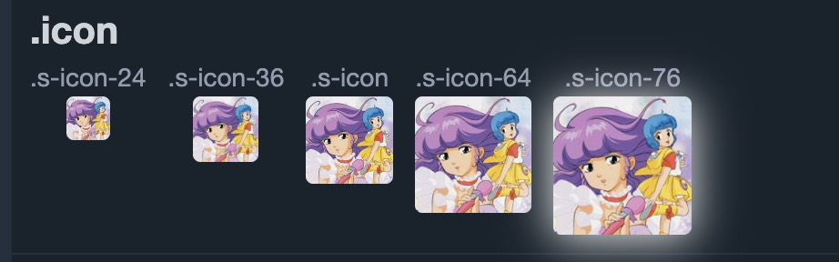

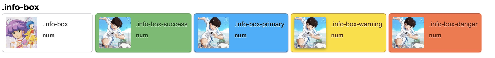
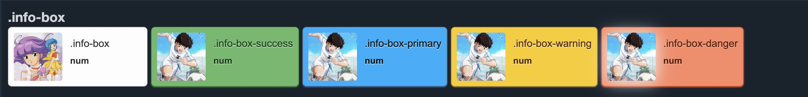

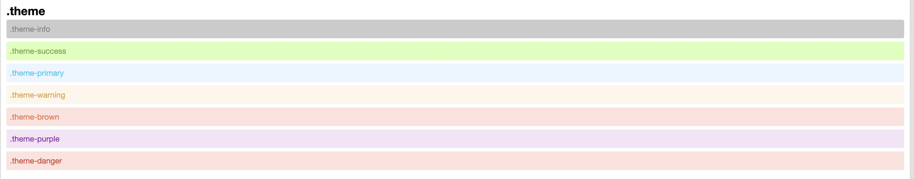
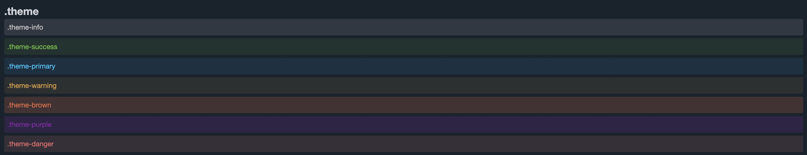

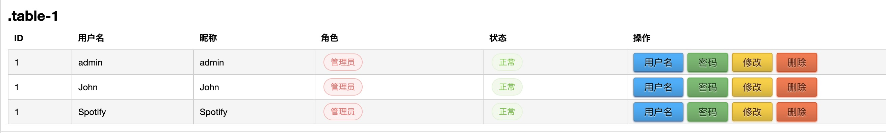
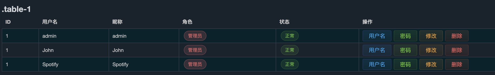

## 致谢

- [V2EX](https://www.v2ex.com/) : V2EX是一个面向开发者的社区论坛
- [GoFrame](https://github.com/gogf/gf) : GoFrame是一个开源的Go语言Web应用框架
- [React](https://github.com/facebook/react) : React是由Facebook开发的用于构建用户界面的JavaScript库
- [next.js](https://github.com/vercel/next.js) : Nextjs是一个基于React的服务器端渲染框架，用于构建可扩展的React应用程序
- [swr](https://github.com/vercel/swr) : SWR是一种React Hooks库，用于在数据获取方面提供高度自动化和简化的体验。
- [axios](https://github.com/axios/axios) : axios是一个基于Promise的HTTP客户端，用于浏览器和Node.js
- [react-toastify](https://github.com/fkhadra/react-toastify) :  react-toastify是一个React通知组件库，用于在应用程序中显示消息
- [js-cookie](https://github.com/js-cookie/js-cookie) : js-cookie是一个简单的JavaScript API，用于处理浏览器中的cookie
