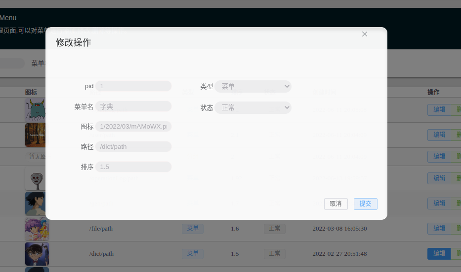
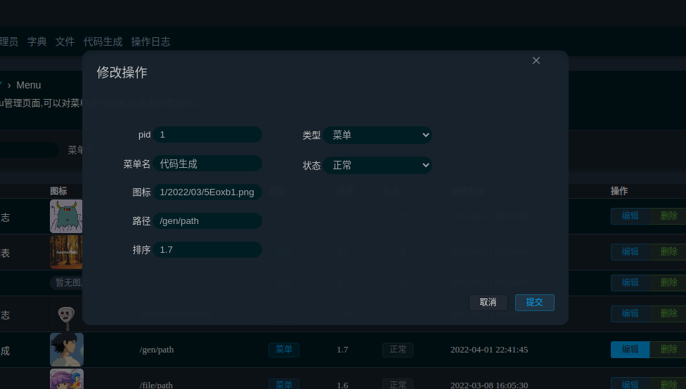
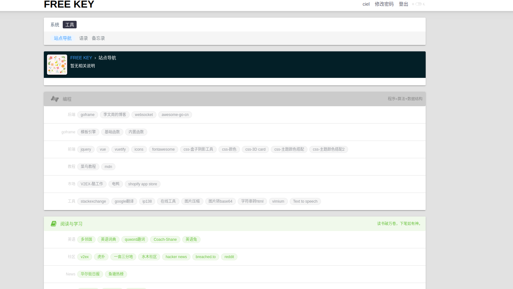
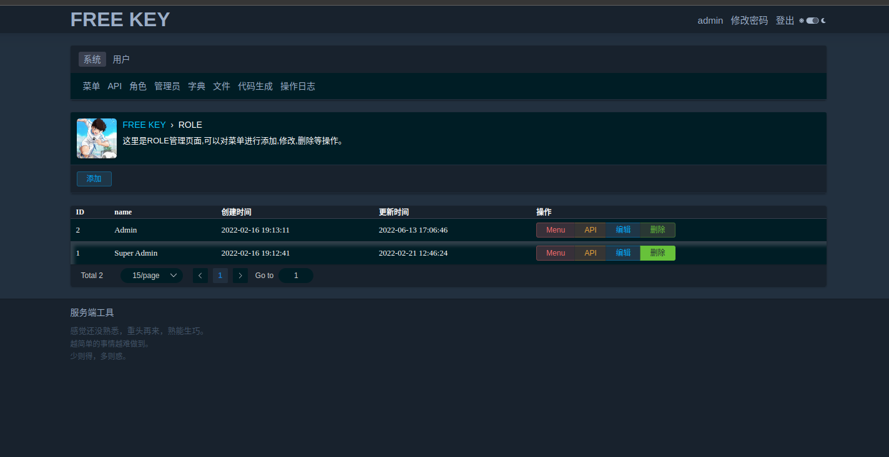
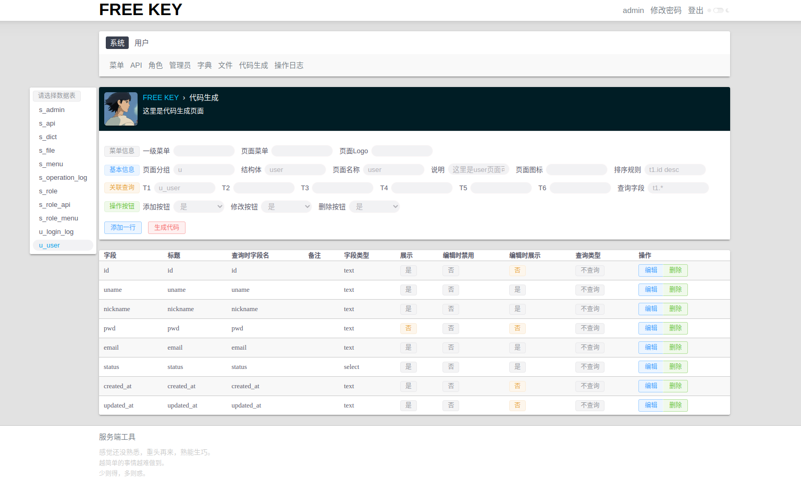
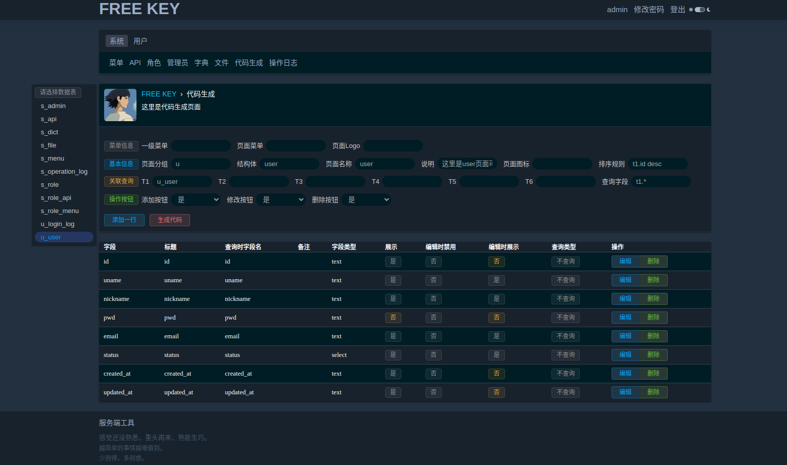

# free key admin 自由钥匙 - 个人的后台管理系统

## 说明

free key admin(自由钥匙) 一个 V2EX(v2ex.com)风格go语言写的个人后台管理系统，提供了权限管理,CURD文件生成,本地文件上传等基本功能。

使用到的技术:

- 后端:goframe v2
- 前端:vue3,element-plus,jquery-3.6.0

## 想要实现的基本功能有这些

- 角色管理 ok
- 字典管理 ok
- 本地文件上传 ok
- CURD文件生成 ok
- WebSocket后台聊天功能 todo
- 记事本功能 todo
- 常用工具集合 todo

这是菜单页面 （图标选择的是小时候喜欢的哆啦 A 梦 ） 

Dialog 修改或添加数据  

角色页面 （图标是小时候喜欢的足球小将）  

代码生成 页面   

## 环境安装

1. golang环境 安装
2. mysql 安装
3. gf 安装
    - 通过官网下载安装 https://goframe.org/pages/viewpage.action?pageId=1115782 建议选择版本 v2.0.0

## 项目结构
- internal
    - cmd
    - consts
    - controller
    - model
        - entity
    - packed
    - service
- manifest
    - config
        - config.yaml
- resource
- utility
- go.mod
- main.go

详情见：https://goframe.org/pages/viewpage.action?pageId=30740166

## 快速开始

1. 创建数据库并导入项目`resource`目录下的`ciel.sql`
2. 修改`config.yaml`文件配置
    - mysql 数据库配置 将数据库信息替换成您自己的
    - redis

3. 启动项目：到项目根目录下执行 `gf run main.go`
4. 浏览器打开 http://localhost:1211/login  默认用户名 `ciel` 密码 `1`

## 使用的框架

- gf 如果您对 gf 不太熟悉，请到gf官网进行相应的学习，gf真的简单又强大。 官网：https://goframe.org/display/gf
    - bilibili gf HelloWorld教程 Quick Start  https://www.bilibili.com/video/BV15R4y1G7hq/
- Vue3: https://vuejs.org/
- element-plus  https://element-plus.org/
- Jquery: https://www.runoob.com/jquery/jquery-tutorial.html

## 反馈

使用过程中如果遇见什么问题，可以发issue或发邮件1211sciel@gmail.com 我看到后会及时回复的。 