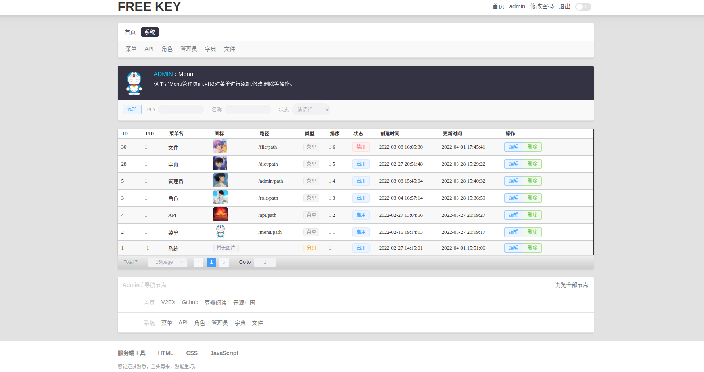
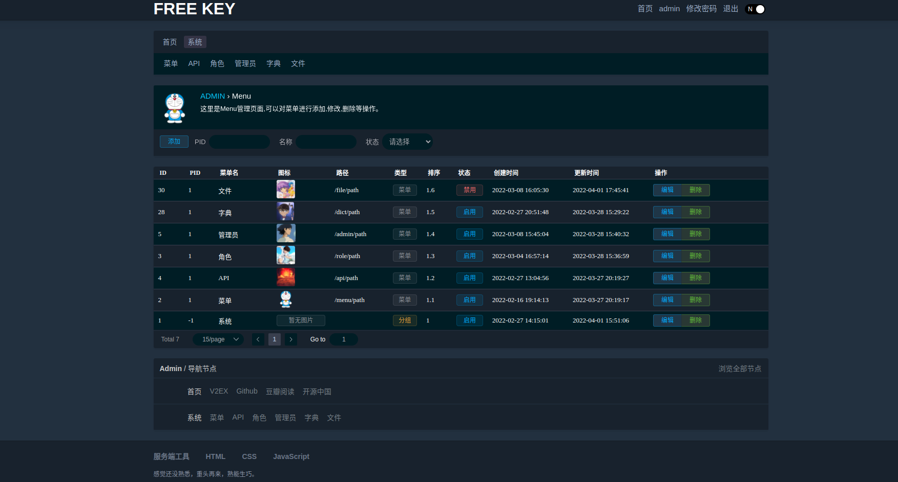
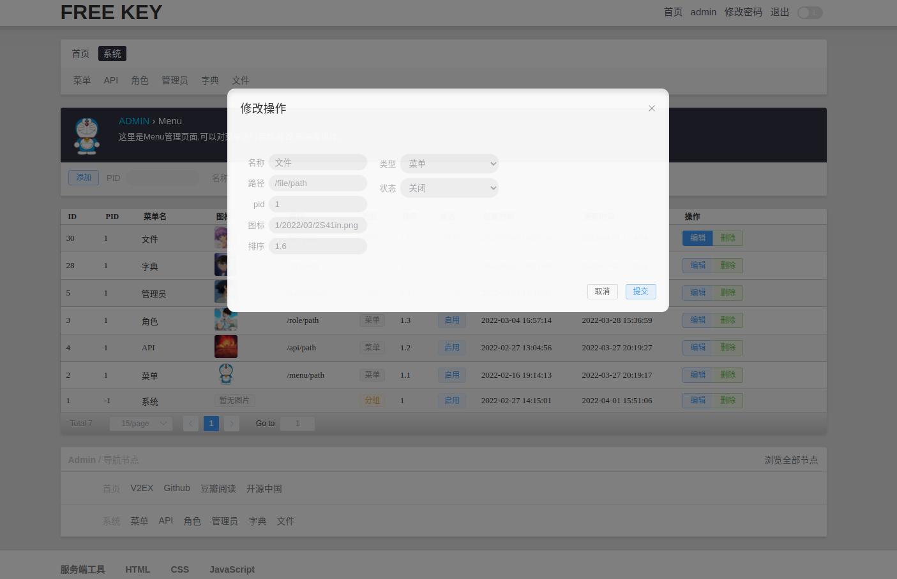
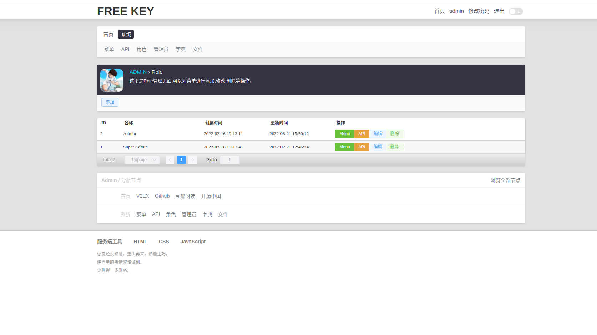
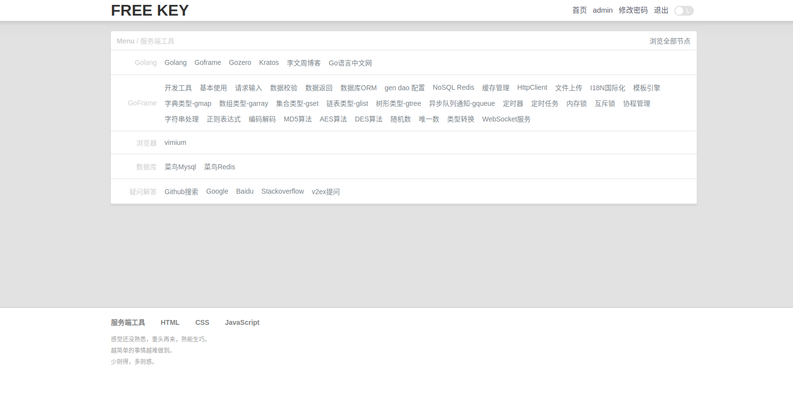
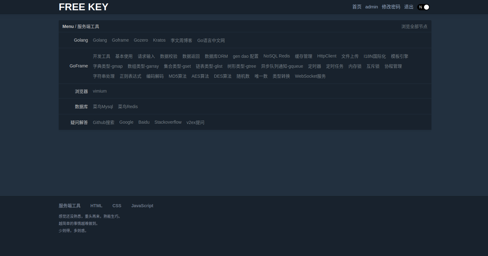
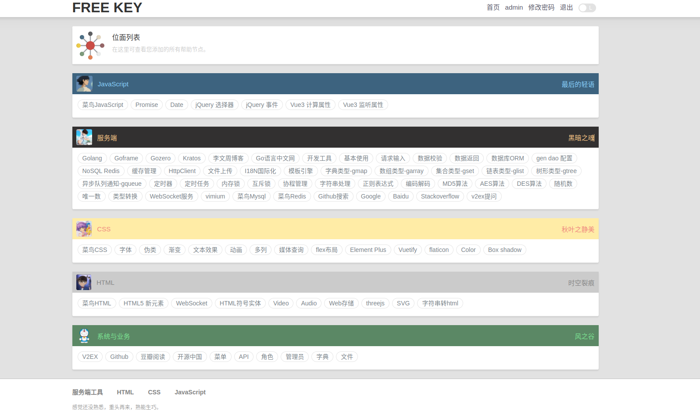
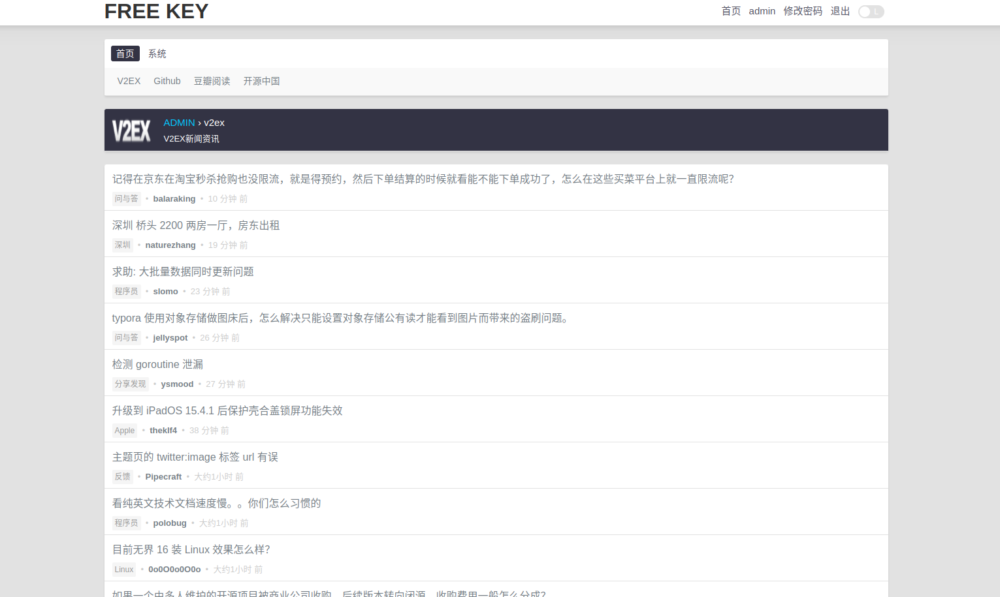
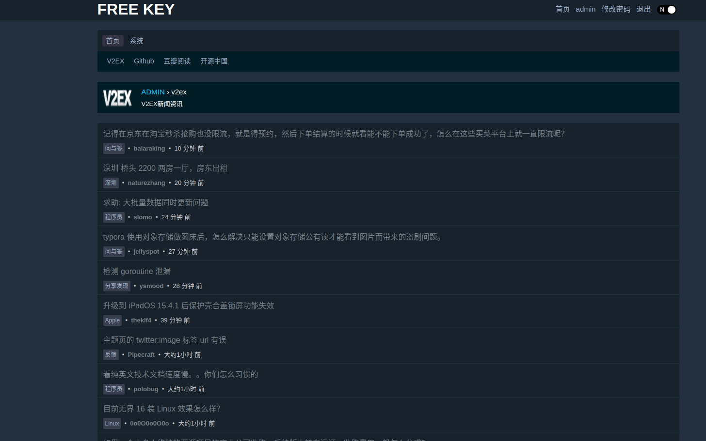
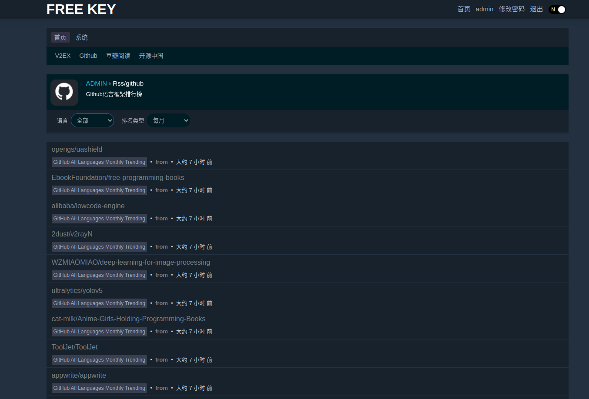

# Free Key Admin 自由钥匙 - 个人的后台管理系统

## 说明

FreeKey Admin 是一个简洁的后台管理系统，提供了权限管理功能,CURD文件生成,常用网站工具导航，本地文件上传等。

前端页面参考 https://www.v2ex.com/ 2022年的风格。

使用到的技术:

- 后端:goframe v2
- 前端:vue3,element-plus,jquery-3.6.0

数据获取方式是服务端渲染页面，前端 ajax 请求数据。（没有使用 vue 单独创建一个项目，整个项目一键启动。）

## 想要实现的基本功能有这些

- 角色管理 ok
- 字典管理 ok
- 本地文件上传 ok
- 夜间模式 ok
- 常用网站导航 ok
- CURD文件生成 todo
- WebSocket后台聊天功能 todo
- 日记本功能 todo
- 常用RSS订阅 ing
- 常用工具集合 todo

这是菜单页面 （图标我选择的是小时候喜欢的哆啦 A 梦 hh ） 

Dialog 修改或添加数据  

角色页面 （图标是小时候喜欢的足球小将） 

常用工具栏之服务端工具页面 

位面列表页面（不同的模块我备注了觉得不错的昵称）

V2EX RSS 资讯页面 

Github RSS 框架语言排行榜页面

## 环境安装

1. golang环境 安装
2. mysql 安装
3. gf 安装
    - 建议通过 官网下载安装 https://goframe.org/pages/viewpage.action?pageId=1115782 建议选选择办版本 v2.0.0
    - 如果您使用的linux系统那么可以直接 使用我们准备好的 项目根目录下的 gf 文件(linux版本)(最好将其放到您常用工具的目录下并为其设置环境变量)

## 项目结构

- internal
    - cmd
    - consts
    - controller
    - model
        - entity
    - packed
    - service
- manifest
    - config
        - config.yaml
- resource
- utility
- go.mod
- main.go

详情见：https://goframe.org/pages/viewpage.action?pageId=30740166

## 快速开始

1. 创建数据库并导入项目根目录下的`ciel.sql`
2. 修改`config.yaml`文件配置
    - 数据库配置 将数据库信息替换成您自己的
    - 图片文件根目录文件夹地址配置：将`server.rootFilePath`值替换成 `/resource/public/upload` 该目录所在的绝对路径

3. 启动项目：到项目根目录下执行 `gf run main.go`
4. 浏览器打开 http://localhost:1211/login  默认用户名 `admin` 密码 `1`

## 使用的框架

- gf 如果您对 gf 不太熟悉，请到gf官网进行相应的学习，gf真的简单又强大。 官网：https://goframe.org/display/gf
    - bilibili gf HelloWorld教程 Quick Start  https://www.bilibili.com/video/BV15R4y1G7hq/
- Vue3: https://vuejs.org/
- element-plus  https://element-plus.org/
- Jquery: https://www.runoob.com/jquery/jquery-tutorial.html
