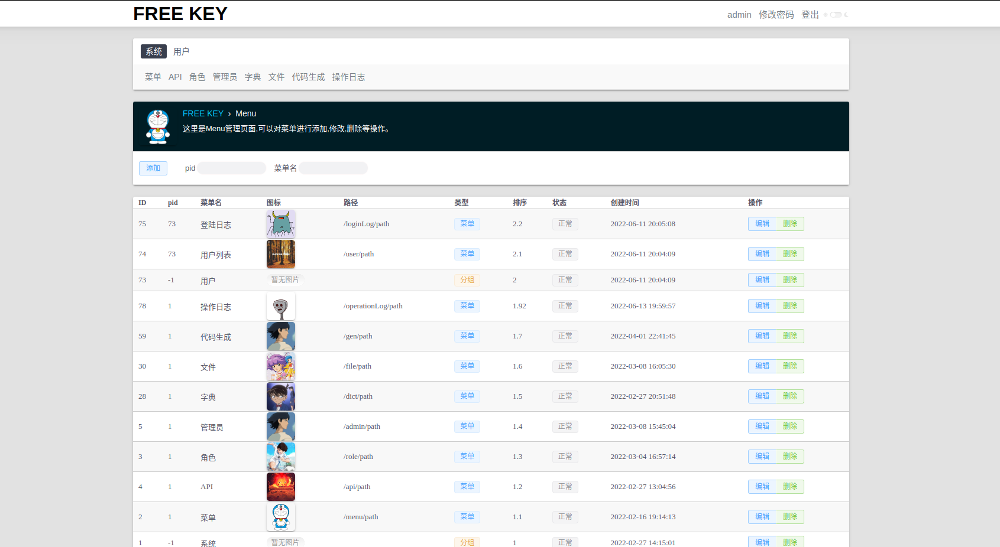
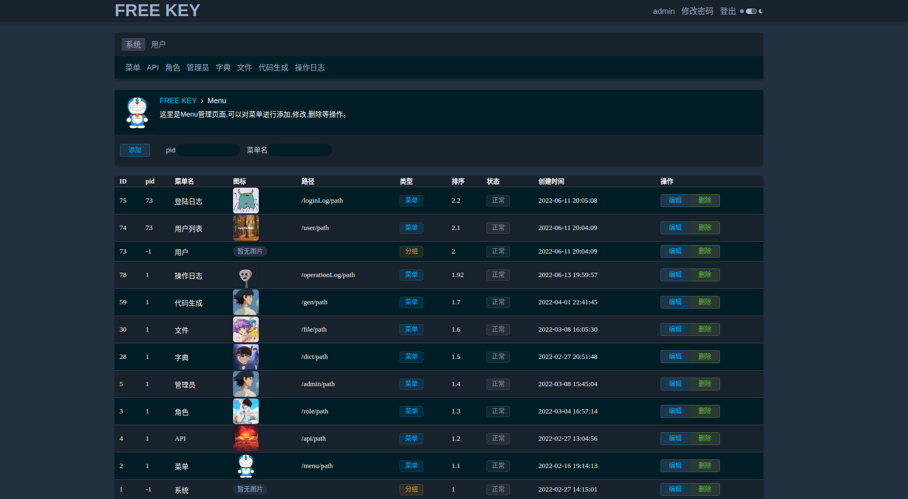
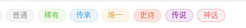
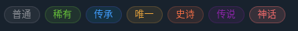
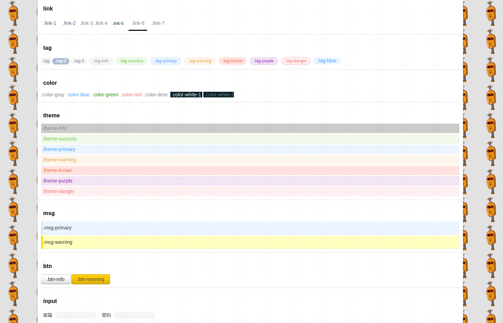
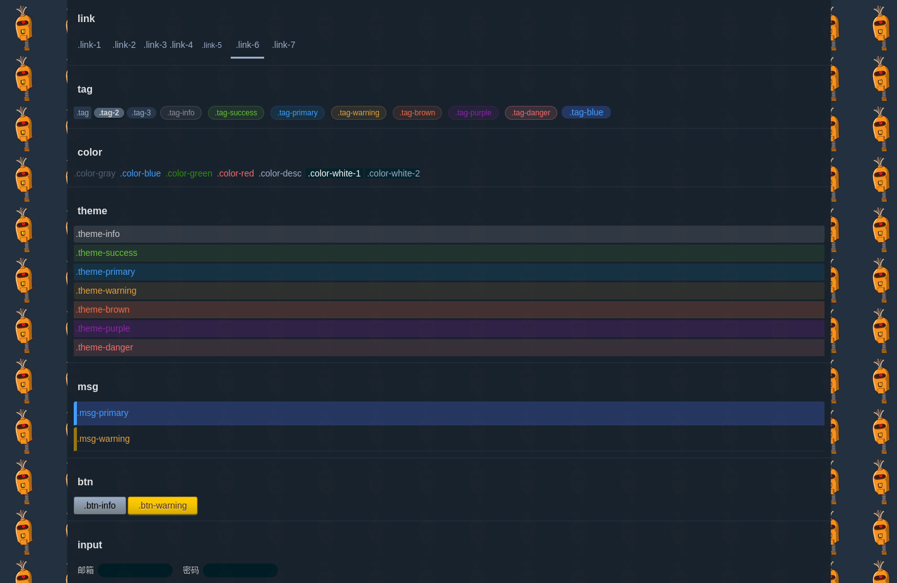

# 🍉 freekey admin 自由钥匙 - 个人的后台管理系统
```
███████╗██████╗ ███████╗███████╗    ██╗  ██╗███████╗██╗   ██╗     █████╗ ██████╗ ███╗   ███╗██╗███╗   ██╗
██╔════╝██╔══██╗██╔════╝██╔════╝    ██║ ██╔╝██╔════╝╚██╗ ██╔╝    ██╔══██╗██╔══██╗████╗ ████║██║████╗  ██║
█████╗  ██████╔╝█████╗  █████╗      █████╔╝ █████╗   ╚████╔╝     ███████║██║  ██║██╔████╔██║██║██╔██╗ ██║
██╔══╝  ██╔══██╗██╔══╝  ██╔══╝      ██╔═██╗ ██╔══╝    ╚██╔╝      ██╔══██║██║  ██║██║╚██╔╝██║██║██║╚██╗██║
██║     ██║  ██║███████╗███████╗    ██║  ██╗███████╗   ██║       ██║  ██║██████╔╝██║ ╚═╝ ██║██║██║ ╚████║
╚═╝     ╚═╝  ╚═╝╚══════╝╚══════╝    ╚═╝  ╚═╝╚══════╝   ╚═╝       ╚═╝  ╚═╝╚═════╝ ╚═╝     ╚═╝╚═╝╚═╝  ╚═══╝
```

## 🍓 追求

用越少的技术、越简单的方式来实现一个面向于web独立开发者的后台管理系统。

## 🍌 说明

freekey admin(自由钥匙) 一个V2EX风格go语言写的个人后台管理系统，提供了权限管理、本地文件上传等基本功能。采用`服务端渲染`，整个项目一键启动。

使用到的技术:

- 后端: goframe v2.0.6, msyql,redis
- 前端: html,css,javascript, jquery-3.6.0

## 🍒 实现的功能

- 角色权限管理
- 字典管理
- 本地文件上传
- 暗黑模式

这是菜单页面 （图标选择的是哆啦A梦 ） 

> 更多浏览在页末

## 🌴 项目结构

```text
├── hack
├── internal   
│   ├── cmd        入口指令                         ---👌 "如果没什么事的话，就让我们开始吧。"
│   ├── consts     常量                            --- 🙂 "请相信，我是永远不会改变的~"
│   ├── controller 控制层     提供对外接口           --- 😀 "您需要的所有功能我都可以为您实现,请告诉我吧~"
│   ├── dao        数据查询层  数据库查询操作在此层执行 --- 🤪 "数据库相关的信息我最了解。"
│   ├── logic      逻辑层     业务逻辑在此层进行处理,  --- 😎 "不管你的逻辑有多复杂，交给在下吧～"
│   ├── model      实体层     包含 bo do entity     --- 🤗 "我这里包含了你可能会用到的所有模型实体。"
│   └── service    服务层     为控制层提供服务支持     --- 🙂 "我只衷心为您服务~"
│       ├── admin                                 --- 🫡 "您想注册一个管理员？"
│       ├── dict                                  --- 😛 "查字典、查字典"
│       ├── file                                  --- 🧐 "让我们上传一个文件吧"
│       ├── role                                  --- 🥺 "这里有好几种角色"
│       ├── sys                                   --- 🙂 "这里是系统服务"
│       ├── view                                  --- 🍓 "我是为html自定义的模板函数,你想享受尽情地编写代码吗？"
│       └── ws                                    --- 🍉 "我提供了Websocket服务"
├── main.go                                       --- 🌞 "go!"
├── manifest   // 配置文件                          --- 🌼 "有什么事情可以先告诉我."
├── resource   // 静态或其他资源                     --- 🍀 "我是html 请到这里找来我吧"
└── utility    // 通用工具                          --- 🐶 "如果其他项目也想使用的话，请交给我."

      "我们一直在这里，等你!"
🌞 👌 🙂 😀 🤪 😎 🤗 🙂 🌞 🌼 🍀 🐶  
```

详情见：https://goframe.org/pages/viewpage.action?pageId=30740166

## 🌸 环境安装

1. golang环境 安装
2. mysql 安装
3. redis 安装
4. gf 安装  https://goframe.org/pages/viewpage.action?pageId=1115782

## ✨️ 快速开始

1. 下载项目 https://github.com/1211ciel/ciel-admin/releases/tag/v.1.0.9
2. 创建数据库并导入项目`resource`目录下的`ciel.sql`
3. 修改`config.yaml`文件配置:`mysql`,`redis` 将数据库信息替换成您自己的
4. 启动项目：到项目根目录下执行 `gf run main.go`
5. 浏览器打开 http://localhost:1211/login  默认用户名 `ciel` 密码 `1`

## 🌈 css使用

### `.tag`

`.tag-info` `.tag-success` `.tag-priamry` `.tag-wanrnig` `.tag-brown` `.tag-purple` `.tag-danger`

 <br> 

### 💦 更多class

https://github.com/1211ciel/ciel-admin/blob/master/documents/class.md
 <br>


## 🥵 反馈

使用过程中如果遇见什么问题，可以发issue或发邮件1211sciel@gmail.com 我看到后会及时回复的。
