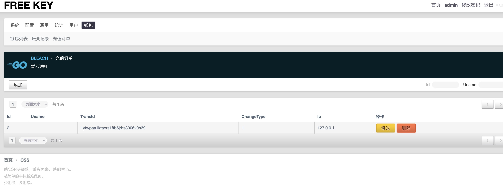

# 充值订单前台api开发

## 1 创建 对外接口信息

在 `/freekey-admin/backend/api/v1/biz.go` 文件中创建

```text
type CreateTopUpReq struct {
	g.Meta `tags:"钱包" sm:"创建充值订单"`
	Type   int     `json:"type" sm:"充值类型 1 支付宝, 2 微信, 3 PayPal" v:"required|in:1,2,3"`
	Money  float64 `json:"money" v:"required" sm:"充值金额"`
	Desc   string  `json:"desc" sm:"备注"`
}
```

> gf 接口文档 常见标签 https://goframe.org/pages/viewpage.action?pageId=47703679

## 2 创建充值路由

进入 `/freekey-admin/backend/internal/cmd/cmd.go`

在 `v1Rooters` 方法中 添加如下代码

```text
	g.Group("/wallet", func(g *ghttp.RouterGroup) {
		g.Middleware(service.Biz.MiddlewareUserAuth)
		g.POST("/topUp", controller.Biz.CreateTopUp)
	})
```

> 这里新添加了一个名为 wallet 的路由分组
>
> `g.Middleware(service.Biz.MiddlewareUserAuth)` 表示在此中间件后面注册的路由需要用户的身份认证。

## 3 创建控制层

进入 `/freekey-admin/backend/internal/controller/biz.go`

```text
func (c cBiz) CreateTopUp(ctx context.Context, req *vCreateTopUpReq) (res *api.DefaultRes, err error) {
	if err = service.Biz.CreateTopUp(ctx, req.Type, req.Money, service.Biz.GetUserIdFromCtx(ctx)); err != nil {
		return nil, err
	}
	return
}
```

> `service.Biz.GetUserIdFromCtx(ctx)` 方法可以对身份认证通过的请求中获取用户的 id

## 4 创建服务层

进入 `/freekey-admin/backend/internal/service/biz.go`

创建一下代码

```text
func (s sBiz) CreateTopUp(ctx context.Context, t int, money float64, desc string, uid uint64) error {
    // 检查是否有未完成的订单 
	count, err := logic.Biz.CheckWaitTopUpCount(ctx, uid)
	if err != nil {
		return err
	}
	if count != 0 {
		return consts.ErrHasOrderNotFinish
	}
	// 创建订单
	if err = logic.Biz.AddTopUp(ctx, t, money, desc, uid); err != nil {
		return err
	}
	return nil
}
```

> 服务层职责: 处理业务逻辑，实现业务流程的组织和控制，调用各种Logic层提供的功能。
>
> 逻辑层职责: 专注于实现具体的业务逻辑，不关心外部调用者是谁，也不关心具体的业务流程，只负责实现功能并提供对外接口。

## 5 创建逻辑层

进入 `/freekey-admin/backend/internal/logic/biz.go`

创建服务层需要的相关方法

### 检查是否有未完成的订单

```text
func (l lBiz) CheckWaitTopUpCount(ctx context.Context, uid uint64) (int, error) {
	count, err := dao.TopUp.Ctx(ctx).Count("uid = ? and `status`=1", uid)
	if err != nil {
		return 0, err
	}
	return count, nil
}
```

### 创建订单

```text
func (l lBiz) AddTopUp(ctx context.Context, t int, money float64, desc string, uid uint64) error {
	d := entity.TopUp{}
	d.Uid = uid
	d.Money = money
	d.Desc = desc
	d.ChangeType = uint(t)
	d.TransId = guid.S()
	d.Status = 1
	d.Ip = ghttp.RequestFromCtx(ctx).GetClientIp()
	if _, err := dao.TopUp.Ctx(ctx).Insert(&d); err != nil {
		g.Log().Error(ctx, err)
		return err
	}
	return nil
}
```

到这里，创建订单接口的所有后端代码已经完成了，下面我们来测试一下接口吧

## 6 测试接口

创建文件 `/freekey-admin/backend/internal/z_httptest/wallet.http`

写入以下内容

```http request
### 创建充值订单
POST {{url}}/v1/wallet/topUp
Authorization: {{token}}
Content-Type: application/json

{
  "type": 1,
  "money": 10,
  "desc": "test"
}
```

然后点击执行. 下面是创建成功的返回信息.

```text
POST http://localhost:2033/v1/wallet/topUp

HTTP/1.1 200 OK
Access-Control-Allow-Credentials: true
Access-Control-Allow-Headers: Origin,Content-Type,Accept,User-Agent,Cookie,Authorization,X-Auth-Token,X-Requested-With
Access-Control-Allow-Methods: GET,PUT,POST,DELETE,PATCH,HEAD,CONNECT,OPTIONS,TRACE
Access-Control-Allow-Origin: *
Access-Control-Max-Age: 3628800
Content-Type: application/json
Server: GoFrame HTTP Server
Trace-Id: f8dfaac0d7325417a76600514967afc9
Date: Sun, 09 Apr 2023 07:14:23 GMT
Content-Length: 35

{
  "code": 0,
  "message": "",
  "data": null
}
Response file saved.
> 2023-04-09T151423.200.json

Response code: 200 (OK); Time: 9ms (9 ms); Content length: 35 bytes (35 B)
```

让我们到后台去查看一下。



已经有订单啦！ 更多的扩展功能及页面的调整部分就不进行展示了。
