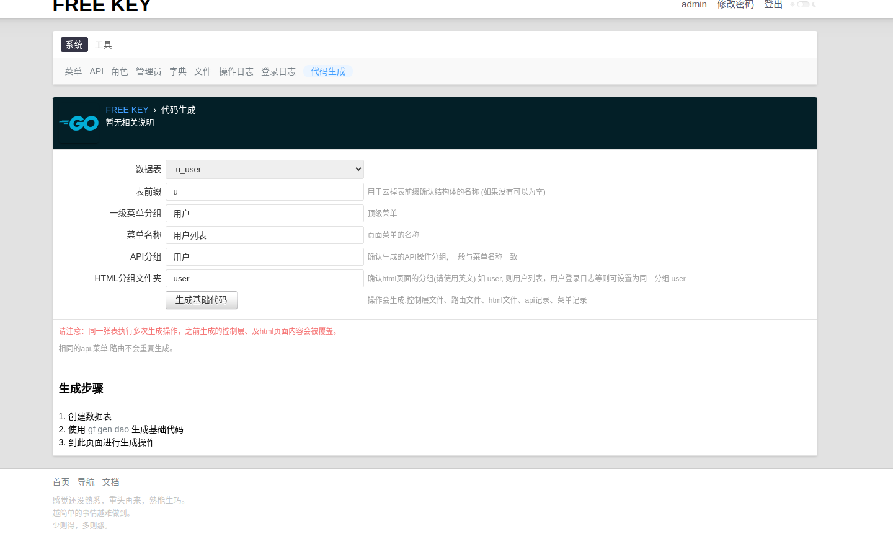
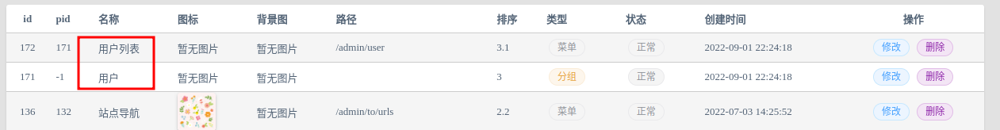
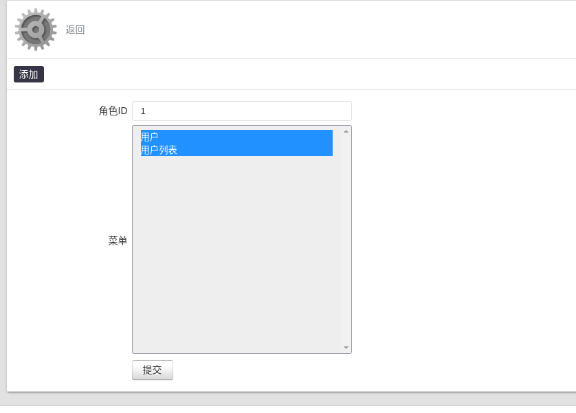
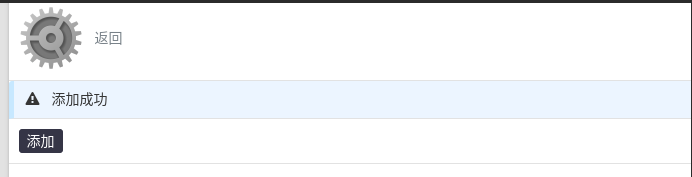
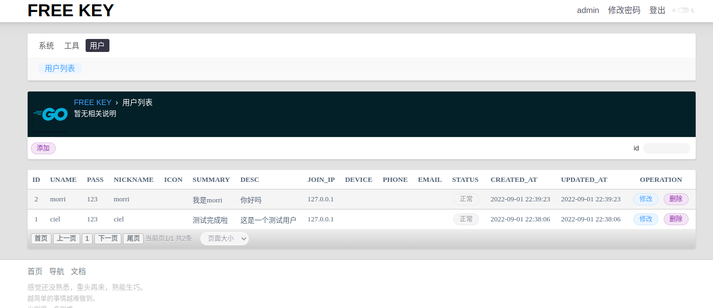
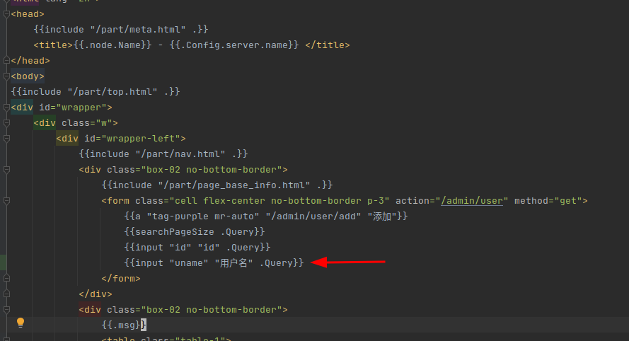
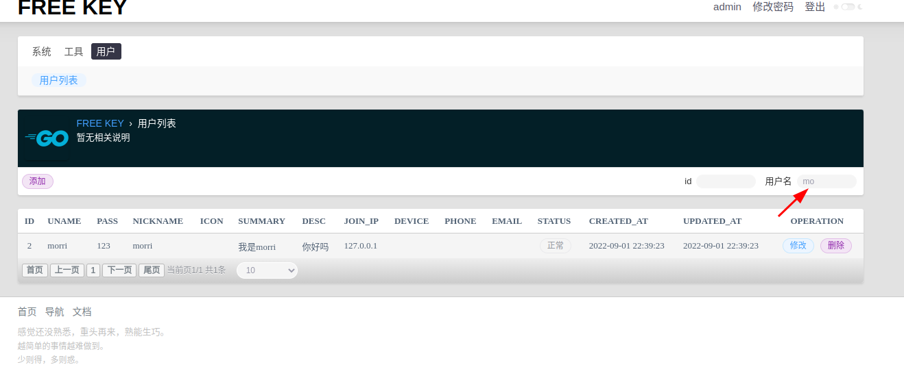

# 🍀 CRUD 代码生成实例

这里 以`用户表` 为例 进行演示

## 1. 创建数据表

```sql
create table u_user
(
    id         bigint unsigned auto_increment primary key,
    uname      varchar(32) unique not null,
    pass       varchar(64)        not null,
    nickname   varchar(64),
    icon       varchar(64),
    summary    varchar(64),
    `desc`     text,
    join_ip    varchar(64) comment '注册IP',
    device     varchar(64) comment '设备名称',
    phone      varchar(16),
    email      varchar(64),
    `status`   tinyint unsigned   not null default 1,
    created_at datetime           not null default current_timestamp,
    updated_at datetime           not null default current_timestamp,
    index (uname),
    index (join_ip),
    index (status),
    index (phone),
    index (email)
)
```

## 2. 配置 config.yml

在 `ciel-admin/hack/config.yaml`添加 数据表`u_user` 和 去除前缀`u_`

```text
# CLI.
gfcli:
  gen:
    dao:
      - link: "mysql:ciel:2zL4YEdLpLJirysN@tcp(127.0.0.1:3306)/ciel"
        tables: "s_admin,s_role,s_menu,s_role_menu,s_api,s_role_api,s_dict,s_file,s_operation_log,s_admin_login_log, 
        u_user"
        removePrefix: "s_,u_"
        descriptionTag: true
        noModelComment: true
```

## 3. 执行 gf gen dao

在项目根目录下打开终端 执行`gf gen dao`

```text
...
generated: internal/model/entity/user.go
done!
```

## 4. 执行代码生成

到 http://localhost:2033/admin/gen 页面 进行相关配置如下



然后点击`生成基础代码`

> 如果您是第一次生成请到 `ciel-admin/internal/cmd/sys_router.go` 文件 手动导入一面两个包

```text
"ciel-admin/internal/controller"
"ciel-admin/internal/service/admin"
```

- 路由代码在 `/ciel-admin/internal/cmd/sys_router.go`
- 控制层代码在  `/ciel-admin/internal/controller/u_user.go`
- 主html页面在 `/ciel-admin/resource/template/user/user/index.html`

可以对其进行您所希望的修改,如将字段名称进行更准确的设置。

## 5. 配置管理员菜单

这时我们到 http://localhost:2033/admin/menu 进行查看可以看到已经生成了两个菜单



进入 [角色页面](http://localhost:2033/admin/role) > [MENU](http://localhost:2033/admin/roleMenu?rid=1 ) > [添加页面](http://localhost:2033/admin/roleMenu/add?rid=1&)

对超级管理员添加新添加的菜单的权限

 

## 6. 退出重新登录

即可看到生成的用户页面
进入 http://localhost:2033/admin/user 进行查看

添加两条测试记录


到这里我们的演出就完成啦！以下是附加功能

---

## 添加用户名搜索

### 1. index.html 页面添加输入框

进入 `ciel-admin/resource/template/user/user/index.html`

添加如下代码

```text
{{input "uname" "用户名" .Query}}
```



### 2. 控制层添加用户名字段

进入 `/ciel-admin/internal/controller/u_user.go`

添加如下代码

```text
{Name: "uname", Type: 2},
```


> 	Type 为查询类型 可选值有 0 no,1 = ,2 like,3 >, 4 <, 5>=,6 <=,7 != 

### 3. 进入页面进行查看

输入 `mo`



好了搜索功能完成啦！

如果你想更进一步了解 可研究一下 http://localhost:2033/admin/menu 菜单页面的前后端代码，简单又好用！

快点开始我们的项目吧！