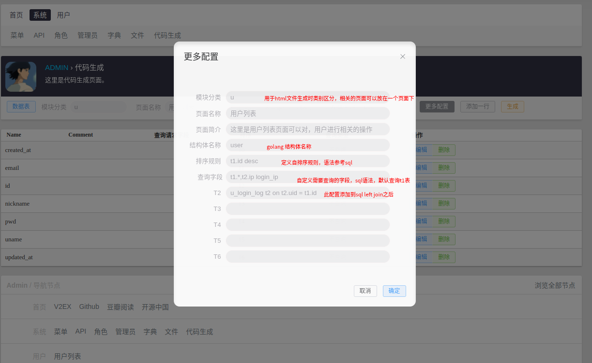
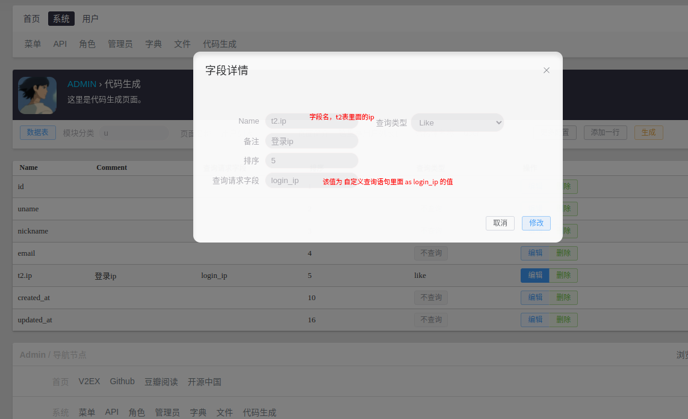
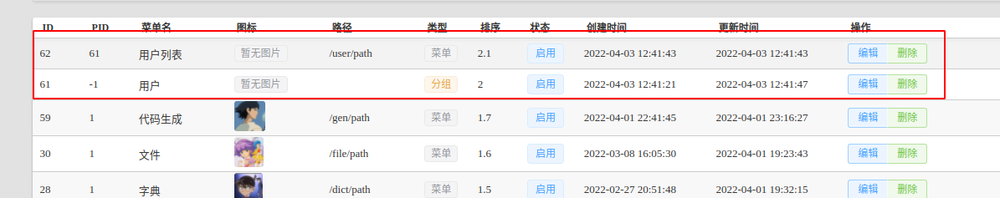
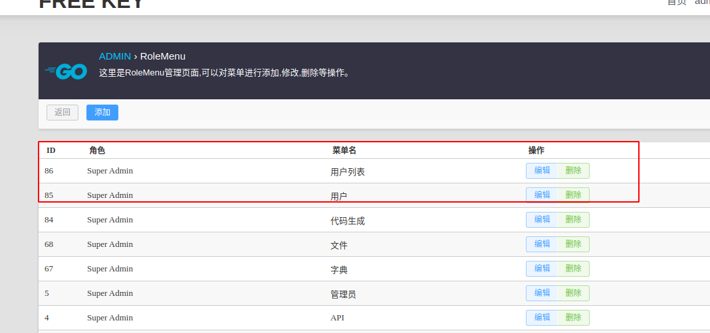
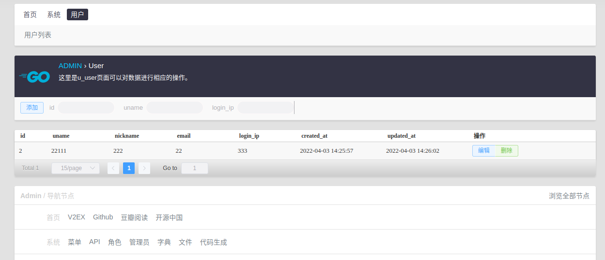

# 多表查询代码生成

以生成用户页面为例,我们需要查询用户表中的相关信息及用户登录日志中的登录IP：

- u_user
- u_user_login_log

### step1 创建数据表

u_user

```sql
create table u_user
(
    id         int auto_increment primary key,
    uname      char(16)                            not null,
    nickname   char(32) null,
    pwd        char(32)                            not null,
    email      char(32) null,
    created_at timestamp default CURRENT_TIMESTAMP not null,
    updated_at timestamp default CURRENT_TIMESTAMP not null on update CURRENT_TIMESTAMP
);

```

u_login_log

```sql
create table u_login_log
(
    id         int auto_increment primary key,
    uid        int      not null,
    ip         char(16) not null,
    created_at datetime not null
);

```

### step2 config.ytml添加数据表信息

```yaml
gfcli:
  gen:
    dao:
      - link: "mysql:ciel_begin:2zL4YEdLpLJirysN@tcp(127.0.0.1:3306)/ciel_begin"
        tables: "s_admin,s_role,s_menu,s_role_menu,s_api,s_role_api,s_file,
        u_user,u_login_log
        "
        removePrefix: "s_,u_"
        descriptionTag: true
        noModelComment: true
```

添加 `u_user,u_login_log` 和`removePrefix: "u_"`

### step3 项目根目录下是使用 gf 工具生成这两张表的相关代码

```yaml
gf gen dao
```

执行结果如下

```text
...
generated: internal/model/entity/login_log.go 
done! 

```

> gf使用的一个优点就是将数据表交于gf工具管理，数据表有新的添加或修改，只需要执行一次 gf gen dao 即可生成相关代码,不需要手动修改，简单方便。

### step4 进入[代码生成页面](http://localhost:1211/gen/path)

选择 `u_user` 表 > 更多配置

按下图进行配置


### step5 添加一行 并设置相关信息



### step5 进入菜单页面创建 用户菜单



### step6 角色页面给角色添加新的订单



### step7 退出重新登录，就可以看到用户页面了。

我们再添加一条测试数据，就可以看到如下结果啦。

